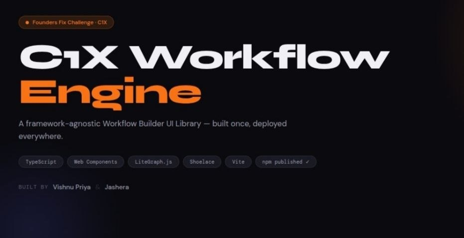

# C1X Workflow Builder UI Library

A standalone, framework-agnostic workflow builder built with a pure TypeScript core engine and a high-performance Web Component wrapper. Designed for building and managing Directed Acyclic Graphs (DAGs) with built-in validation, history management, and seamless framework integration.

## 🏗 System Architecture

The project follows a clean separation of concerns:

```mermaid
graph TD
    subgraph "Host Application (React/Angular/Vue)"
        A[HTML Template] -->|Embeds| B(c1x-workflow-builder)
        C[Application Logic] <-->|API Calls & Events| B
    end

    subgraph "Web Component Wrapper"
        B --> D[Workflow Component]
        D <-->|Bridge| E[Core Engine]
        D <-->|Render| F[LiteGraph UI]
    end

    subgraph "Core Engine (TypeScript)"
        E --> G[Workflow Store]
        E --> H[History (Undo/Redo)]
        E --> I[DAG Validator]
        E --> J[JSON Serializer]
    end
```

## 🚀 Key Features

- **Pure TypeScript Engine**: Core logic is independent of any UI framework.
- **Robust State Management**: Centralized store for workflow nodes, connections, and metadata.
- **Undo/Redo System**: Full action history tracking for all workflow modifications.
- **Cycle Detection**: Real-time validation to ensure the workflow remains a valid DAG.
- **Web Component Interface**: zero-dependency integration into React, Angular, Vue, or vanilla JS.
- **LiteGraph Powered UI**: High-performance HTML5 Canvas rendering for large-scale workflows.

## 🛠 Project Structure

- `src/core/`: The framework-agnostic engine (Store, Validator, History).
- `src/ui/`: UI components and LiteGraph integration.
- `src/components/`: Web Component registration and public API.
- `examples/`: Integration examples for modern frontend frameworks.
- `demo/`: Standalone demo using the compiled library.

## 📦 Getting Started

### Prerequisites
- Node.js (v18+)
- npm

### Installation & Build
```bash
# Install dependencies
npm install

# Build the library (outputs to /dist)
npm run build
```

The build generates:
- `dist/index.js` (ES Module)
- `dist/index.cjs` (CommonJS)
- `dist/index.d.ts` (TypeScript Definitions)
- `dist/c1x-workflow-builder-flowforge.css` (Styles)

## 🔧 Integration Guide

### 1. Register the Component
Import the library once at the entry point of your application:
```ts
import "c1x-workflow-builder"; // Registers the <c1x-workflow-builder> element
import "c1x-workflow-builder/dist/c1x-workflow-builder-flowforge.css";
```

### 2. Usage in Templates
```html
<c1x-workflow-builder 
  workflow-id="unique-id-001" 
  theme="light">
</c1x-workflow-builder>
```

### 3. Public API Methods
Access the component instance to interact with the workflow:
```ts
const builder = document.querySelector("c1x-workflow-builder");

// Export workflow to JSON
const data = builder.getWorkflow();

// Import workflow from JSON
builder.loadWorkflow(jsonData);

// History operations
builder.undo();
builder.redo();

// Viewport operations
builder.fitToScreen();
```

### 4. Event System
Listen for state changes and user interactions:
```ts
builder.addEventListener('workflow-ready', (e) => console.log('Engine Initialized'));
builder.addEventListener('workflow-change', (e) => console.log('Workflow Updated', e.detail));
builder.addEventListener('workflow-validation-failed', (e) => console.error('Cycle Detected!'));
```

## 📖 Framework-Specific Examples

Detailed examples are provided in the `/examples` directory:
- **[React Demo](file:///home/boss/Desktop/hack_new_c/final_project/examples/react-demo)**: Shows how to use the builder within a React functional component.
- **[Angular Demo](file:///home/boss/Desktop/hack_new_c/final_project/examples/angular-demo)**: Demonstrates integration with `CUSTOM_ELEMENTS_SCHEMA`.

---

© 2026 C1X Workflow Builder Team
